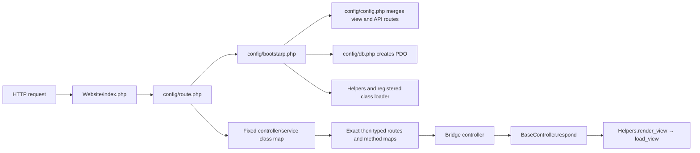
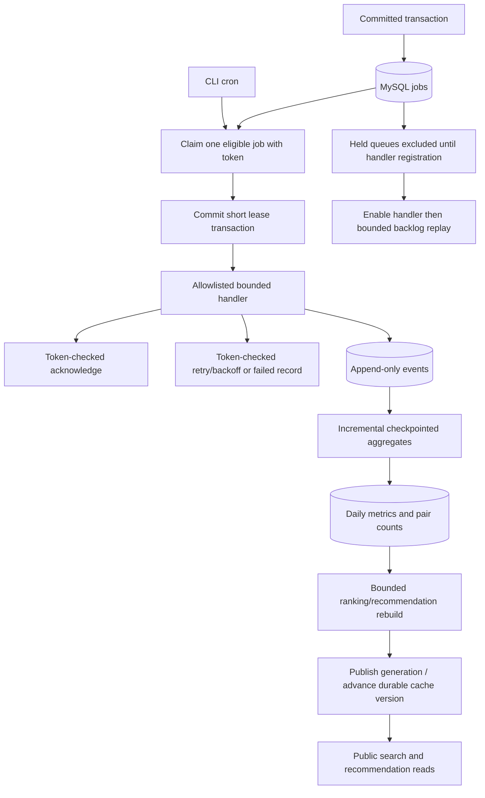

# Data flows and authority

The foundation request path is implemented; commerce flows below remain designs for upcoming modules. Values and transaction ownership are defined in [contracts.md](contracts.md). Select the appropriate [task guide](tasks/README.md).

## Existing request path



Source entry points: [index](../../Website/index.php#L2), [route loader](../../Website/config/route.php#L2), [bootstrap](../../Website/config/bootstarp.php#L3), [dispatch](../../Website/core/RouteManager.php#L5), [render helper](../../Website/core/Helpers.php#L11). FND-02 implemented method/parameter resolution and safe nested loading in this pipeline.

## Admin catalog mutation and public reads

```mermaid
sequenceDiagram
    participant A as Staff browser
    participant C as AdminProductController
    participant S as ProductService
    participant D as MySQL
    participant F as Public image storage
    participant K as Cache
    A->>C: POST fields, revision, CSRF, image
    C->>C: Current grant, CSRF, field/file validation
    C->>F: Stage safe image with generated name
    C->>S: Validated DTO + server actor
    S->>D: BEGIN; lock product/variants
    S->>D: Write catalog/image metadata, audit, increment version
    S->>D: COMMIT
    S-->>C: New revision
    C->>K: Optional old-key eviction / warmup after commit
    C-->>A: Redirect or validated JSON response
    Note over D,K: Public reader obtains committed version before its cache key
```

On validation/DB failure, discard staged unreferenced files and return safe errors. Publish the final image file before committing metadata that points to it; if DB commit fails, remove it when safe or schedule orphan cleanup. A process crash can leave an orphan file, which bounded cleanup reconciles. Replacing an image does not remove the old file before commit. Filesystem and SQL are not one atomic transaction.

Public catalog flow: route → validated filters → current DB cache version → cache lookup → ProductService/SQL on miss → escaped public DTO → versioned cache write → public response. A version change makes prior keys obsolete. Cart/checkout/account responses are private/no-store. See [cache](tasks/06-cache.md) and [admin](tasks/07-admin.md).

## Cart to committed order

```mermaid
sequenceDiagram
    participant B as Customer
    participant C as Checkout controller
    participant S as OrderService
    participant D as MySQL
    participant W as Cron worker
    participant P as Notification provider
    B->>C: POST cart revision, address, mode, key + CSRF
    C->>C: Authenticate, own cart/address, validate key
    C->>S: Server principal and validated checkout input
    S->>D: BEGIN; insert/lock checkout_requests key
    alt Same completed key/fingerprint
        D-->>S: Original order/result
    else New checkout
        S->>D: Lock cart/reservation/variants/stock in order
        S->>D: Calculate prices/tax; validate live stock
        S->>D: Write order/items/history and consume stock
        S->>D: Write audit/version, email job, held event intent
        S->>D: Complete key/result; COMMIT
    end
    S-->>B: Persisted order response
    W->>D: Claim enabled email queue; commit lease
    W->>P: Bounded send outside SQL transaction
    W->>D: Acknowledge only current lease token
```

Price, stock, ownership and result authority are MySQL. Browser totals are previews. Duplicate keys serialize through a unique DB record, not a cache lock. If any required SQL write fails, roll back the entire new checkout. A browser timeout after commit is recovered by repeating the same key. If the provider accepts a send but acknowledgment is lost, a retry can duplicate delivery unless the provider supports idempotency; the order itself remains single.

For this MVP, accepted order placement consumes stock immediately. Later shipping does not consume it again. See the precise states and cancel/restock rules in [inventory/orders](tasks/04-inventory-orders.md).

## Cron, queues, analytics and recommendations



Queue ownership and business-effect idempotency are separate. Event ingestion has unique business keys; aggregate batches update metrics and checkpoint atomically. Recommendation rebuilds publish a complete generation so visitors do not read partially rebuilt sets. No customer request calls Drive, scans the entire events table, runs pairwise history joins, or performs provider sends. See [queue](tasks/05-queue.md) and [analytics/search](tasks/09-analytics-search-pricing.md).

## Optional import and mobile flows

Import: staff upload/manual Drive trigger → private staged file → import job → bounded schema validation/dry-run → per-batch ProductService upsert/audit/cache-version updates → progress/log checkpoint → summary. Queue jobs carry file IDs/references, not entire spreadsheets. Downloads are bounded and account-authorized; no customer-request provider fetches.

Mobile later: widget → existing repository interface → opt-in Api repository → versioned HTTP contract → Vayu controller → same business service → MySQL. Server prices and order state replace demo calculations as authority. Room/calculator modules remain local. Offline orders never silently become real orders. See [optional/mobile](tasks/11-optional-mobile.md).
