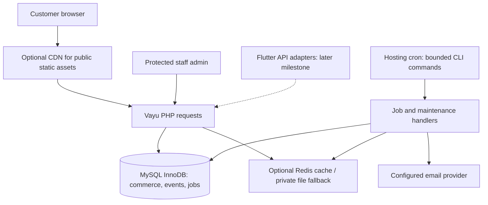

# Stage 1 commerce implementation plan

Date: 2026-10-05. Target: the existing Vayu application on Hostinger shared hosting, with MySQL as the production database and Redis as an optional cache.

## Scope and delivery boundary

The current delivery creates planning documents and agent instructions. All implementation tasks remain open until completed with evidence in [tracking.md](tracking.md).

Implementation detail is split into [11 focused task guides](tasks/README.md), backed by [verified code references](code-map.md), [shared contracts](contracts.md), and [data-flow diagrams](data-flow.md). Read the guide for one selected task; the plan below defines scope, dependencies and acceptance. Guides supply concrete algorithms and targeted SQL rather than boilerplate classes.

The first implementation milestone is a working, locally verified commerce MVP: staff permissions, product/variant/image administration, inventory, storefront, carts, transactional orders, versioned APIs, bounded jobs, cache fallback, events, simple search/recommendations, and an operations runbook. Real payment providers, Drive integration, richer marketing/review features, and mobile networking are separate optional milestones. Deployment to a real Hostinger account is a separate authorized action.

Preserve Vayu and the Developer console. Build server-rendered PHP pages with existing/local Bootstrap assets. Do not add Laravel, Nuxt, search daemons, Kafka, Kubernetes, or dedicated pricing/recommendation services to this milestone.

## Verified repository baseline

| Area | Observed code | Consequence |
| --- | --- | --- |
| Routing | `Website/app/view.php`, `Website/api/gateway.php`, `core/RouteManager.php` | Exact path lookup only; no route parameters or HTTP-method enforcement yet |
| Controller loading | `Website/config/route.php` | Explicitly requires Welcome and Developer; nested Admin/Storefront controllers need a deliberate loading strategy |
| Bootstrap | `Website/config/bootstarp.php` | Keep the existing misspelled filename compatible; core files load through a glob, new service dependencies need explicit loading/autoloading |
| PDO | `Website/config/db.php` | SQLite/MySQL branches exist; MySQL DSN does not currently apply the configured port or explicit charset |
| Migration framework | `config/migrate.php`, `config/migration.php`, `database/migrations/UsersTable.php` | Ledger and users table use SQLite `AUTOINCREMENT`; runner/class ordering and safe MySQL support need repair |
| CLI | `Website/vayu` | Has help, run, developer:create; migrate/queue/maintenance commands are proposed additions |
| Authentication | `core/Auth.php`, `core/DeveloperAccess.php` | Customer auth and dedicated Developer identities exist; commerce roles/permissions and auth hardening still need work |
| Dependencies | `Website/composer.json` | PHPMailer and dotenv only; no queue, Redis client, or commerce package |
| Existing regression | `Website/tests/DeveloperAccessTest.php` | In-memory SQLite Developer access check; it does not prove commerce/MySQL correctness |
| Mobile | `Mobile/lib/data/repositories/`, `Mobile/PROJECT_PLAN.md` | Static repositories and offline UI already exist; preserve interfaces and local behavior |
| Release | `Docs/releases.md` | Root `main` contains sources; generated release branches and sync have publishing effects |

This baseline is based on source inspection, not a production capability audit. No Hostinger account, database version, Redis access, cron frequency, template license, or capacity target has been verified here.

## Architecture and hosting discovery



Database jobs remain the durable queue when Redis is available. This avoids maintaining two queue implementations and keeps enqueue atomic with orders. APCu is an optional later optimization; it is not required for correctness. PHP sessions remain on the configured hosting session store initially.

`HST-01` records the actual PHP/CLI versions and path, PDO drivers, MySQL or MariaDB version, InnoDB/FULLTEXT support, memory/time limits, document root/rewrite/subdirectory behavior, cron minimum interval and overlap behavior, writable private paths, outbound SMTP/HTTPS, backup/restore support, and optional Redis extension/connection availability. Do not assume a one-minute cron schedule, MySQL 8 `SKIP LOCKED`, or a particular PHP extension.

Worker runtime is configurable below the measured hosting limit (an initial 30-second target is a proposal). Cron latency affects notification and maintenance latency; scheduling every five minutes is not real-time processing. CLI cron is preferred. Do not expose public GET routes that execute work; if CLI is unavailable, a separate authenticated, replay-resistant, rate-limited POST worker design must be reviewed and implemented before use.

## Data model and migration policy

Retain `users_tbl` as the commerce identity source. Add `roles`, `permissions`, `user_roles`, and `role_permissions`; use explicit grants such as `admin.products.view`, `admin.products.edit`, `admin.inventory.adjust`, and `admin.orders.edit`. Customer profiles can extend user data later. Do not create duplicate customer/admin password stores. Keep existing `developer_accounts` and console authorization independent.

Ordered migrations must support MySQL/InnoDB/utf8mb4 and practical SQLite development. Verify the existing `UsersTable` upgrade path rather than assuming an old migration will rerun. An already-migrated SQLite database and a fresh MySQL database are different cases. MySQL DDL may auto-commit: recover and rerun interrupted migrations through explicit schema checks, not a promise of transactional DDL rollback. Backup existing data before production migrations and document forward repair; destructive down migrations are for disposable development databases.

| Group | Tables and required decisions |
| --- | --- |
| Identity | Existing `users_tbl`; `roles`, `permissions`, `user_roles`, `role_permissions`; unique grants and disabled-account behavior |
| Catalog | `categories`, `brands`, `products`, `product_variants`, `product_images`; unique slug and SKU; inactive/archived states; variant units, finish, thickness, dimensions |
| Inventory | `inventory`, `inventory_reservations`, `inventory_reservation_items`, `inventory_movements`; one inventory row per stock-bearing variant; on-hand/reserved quantities; reservation owner, expiry, state; unique movement business key |
| Customer commerce | `addresses`, `carts`, `cart_items`; authenticated owner or opaque guest-token hash, never an arbitrary client-supplied user ID |
| Orders | `orders`, `order_items`, `order_status_history`, `checkout_requests`; unique checkout key scoped to principal; immutable item/address/price/tax snapshots; explicit status machine |
| Async | `jobs`, `job_failed`, `notification_deliveries`; queue/type/version/payload, availability, attempts, lease owner/token, reserved/lease times, max attempts, sanitized error, optional deduplication key; delivery records introduced with ORD-02 handlers |
| Cache | Private file cache by default; `cache_entries` only if the hosting filesystem requires a DB cache fallback; durable catalog/cache version metadata |
| Operational | `admin_activity_log`; actor/action/target/request correlation; append-only audit writes for privileged mutations |
| Analytics | `events`, separate `event_processing` metadata, `product_daily_metrics`, bounded pair contribution/count tables, `product_recommendations`, generation/checkpoint metadata; bounded payload, deduplication key, retention |
| Pricing capability | `pricing_rules` through required MVP task `PRC-01`; the capability ships default-off, and activating factors is a store configuration decision |
| Optional features | `wishlists`, `reviews`, `coupons`, `campaigns`, redemption records, `google_drive_sync_logs` when the corresponding optional task is authorized |

MVP pricing initially uses a fixed base price. Required task `PRC-01` introduces factor support behind a default-off switch; its `pricing_rules` migration is part of that task, not a prerequisite for the earlier base-price checkout tasks. Search may add a `tags` column/normalized representation to products. Choose a JSON representation compatible with the verified database version; do not assume MySQL/MariaDB JSON syntax is identical.

Required indexes and constraints:

- `products(slug)` unique; `products(category_id, status, is_featured)`; add brand/filter indexes using actual query plans.
- `product_variants(sku)` unique; `inventory(variant_id)` unique; reservation `(state, expires_at)` and owner lookup indexes.
- `orders(user_id, created_at)`; unique order number; `order_items(order_id)`; unique principal/idempotency key in `checkout_requests`.
- `events(user_id, event_type, created_at)`, `events(product_id, event_type)`, and `(created_at, id)` for incremental aggregation/retention.
- `jobs(queue, reserved_at, available_at)` as the initial requested index; refine/add lease-ready indexes after measuring the final claim query.
- Unique role/grant pivot pairs and foreign keys with compatible types/collations. Cascade only disposable association rows; restrict/archive catalog records referenced by orders and preserve audit/order history.

Use canonical integer minor-unit money and milli-unit quantities in SQL/PHP as specified in [contracts.md](contracts.md); fixed-precision `DECIMAL` can be used for reporting/import staging with explicit conversion. Do not calculate binary float totals. Document INR as the initial currency, square-foot/slab/box conversion, minimum increments, wastage rules, tax mode, discounts, shipping, and rounding. Tax rates are store configuration to verify before launch; do not copy a mobile demo tax constant as a production legal decision. Store commerce timestamps in UTC and render local dates explicitly; queue lease timestamps use database epoch seconds.

## Correctness contracts

### Checkout and inventory

Cart creation and checkout preview do not reserve stock by default. Accepted MVP order placement reserves and consumes in the same transaction; shipment does not consume stock again. If an explicit pre-checkout reservation is later enabled, give it a configured expiry and use the same lock/state rules. Store reservation lines/ownership explicitly.

In one bounded transaction, lock stock rows in a deterministic variant order, validate server prices/quantities/permissions, acquire or consume a still-valid reservation, create the order and immutable snapshots, record the checkout idempotency result, write a deduplicated purchase event intent, and enqueue durable notification jobs on the same PDO connection. Define stock arithmetic once: reserve increases reserved; accepted placement consumption decreases both on-hand and reserved; expiry/cancel before consumption decreases reserved only. Allowed cancellation after placement consumption restores on-hand once through a unique movement. Lock/recheck expiry and stock for every transition.

Retry deadlocks only a bounded number of times. A duplicate checkout key with identical input returns the original order; conflicting input is rejected. Expired leases must not make a reservation valid merely because cleanup cron has not run. Stock availability and checkout prices are always revalidated from MySQL; cached listings may be advisory.

External provider calls happen outside DB transactions. Durable queue/outbox records ensure no committed order loses its notification intent. Handlers tolerate duplicate deliveries; exactly-once SMTP/WhatsApp delivery is not promised. Real payment authorization/webhooks are deferred to `OPT-04`.

### Queue and cache

Queue jobs use allowlisted type/version handlers and JSON payload validation, never serialized executable objects. On supported MySQL use `FOR UPDATE SKIP LOCKED` in a short claim transaction. Otherwise use a tested atomic conditional claim/update with an unguessable lease token and bounded lock wait. Execute handlers outside the claim transaction. Acknowledge/retry/fail only while the same token still owns the lease; renew only if needed and within bounded runtime. Choose a lease greater than the maximum job execution deadline.

Enforce max jobs, runtime, per-handler I/O timeouts, exponential backoff with jitter, max attempts, dead-letter visibility, and a controlled retry command. Handle worker crashes, overlapping cron, poison payloads, and stale owners. Async work includes notifications, reservation cleanup, low-stock alerts, aggregates, cache warmups, and later imports. Essential inventory/order decisions remain synchronous.

Cache interface: `get`, `set` with TTL, `forget`, and catalog version invalidation. Private files use hashed filenames, atomic writes, bounded payloads, permissions, and expiry cleanup; never interpolate raw keys into paths. Redis connections use short timeouts and fall back after failures. Version public listing/detail/recommendation keys and advance the durable authoritative version in the same database transaction as the mutation. Readers obtain the current version from the database before selecting a cache namespace, so old in-flight writers cannot repopulate current keys and a crash before external eviction cannot expose an old namespace as current. Do not cache that version lookup without an equivalent proven consistency protocol. External eviction/warming occurs after commit. If version lookup fails, bypass cache and use authoritative reads; if advancement fails, roll back the mutation. Validate stock/prices in SQL on checkout regardless of cache.

Public pages may use explicit cache headers only when free of user/session data. Admin, account, cart, checkout, and authenticated API responses use private/no-store policy. CDN static assets are safe default targets; do not enable blanket HTML caching.

### Request and access boundaries

Add method-aware routes and safe slug/ID parameters while preserving legacy exact routes, `default`, `?route=`, and subdirectory deployments. Give known paths with unsupported methods a 405 response; unknown paths a 404. Centralize loading of nested classes/services without arbitrary filesystem dispatch.

Admin HTML and `/api/admin/...` must require commerce staff grants; enforce record ownership on customer addresses, carts, and orders. Use CSRF for cookie/session mutations, regenerate session IDs after authentication, configure secure/HttpOnly/SameSite cookies, and throttle authentication. Existing Developer accounts retain their own session keys and grant checks. Review Auth includes, disabled/locked account behavior, and remember-token hashing/expiry/rotation before exposing customer auth.

Validate image MIME using available server tools, byte size, dimensions, extension, and destination; generate filenames and prevent execution/path traversal. Do not accept SVG uploads by default. Only public product images belong in public storage; imports, logs, cache, secrets, and original private files remain inaccessible by HTTP. Escape all views. APIs expose structured errors and request correlation IDs without database errors, tokens, passwords, or raw PII.

## Proposed file layout and route surface

```text
Website/
  app/bridge/Admin/            Dashboard, Product, Inventory, Order, Customer controllers
  app/bridge/Storefront/       Catalog, Product, Cart, Checkout, Account controllers
  app/page/admin/              layout, products, inventory, orders, settings views
  app/page/storefront/         catalog, product, cart, checkout, account views
  app/Services/               Product, Inventory, Order, Pricing, Event,
                              Recommendation, Queue services
  core/                       Cache.php, Queue.php, commerce access/request helpers
  database/migrations/        ordered driver-aware migrations
  assets/admin/               local Bootstrap/Sneat-style assets and license notices
  tests/                      behavioral PHP and MySQL integration checks
  vayu                        migrate, queue:work, queue:retry, maintenance commands
```

Private storage location is configurable outside the document root where supported; otherwise require server deny rules verified by HTTP probes. New directories are proposals, not existing implemented modules.

| Surface | Proposed routes | Behavior |
| --- | --- | --- |
| Admin | `/admin`, `/admin/products`, `/admin/products/create`, `/admin/products/{id}/edit`, `/admin/orders`, `/admin/inventory`, `/admin/customers`, `/admin/settings` | GET reads; explicit POST mutation routes, staff grants, CSRF, audit |
| Storefront | `/`, `/category/{slug}`, `/product/{slug}`, `/cart`, `/checkout`, `/account` | Public catalog; owned carts/account; protected mutations |
| Public API | `/api/v1/products`, `/api/v1/products/{slug}` | Pagination, filters, sort; documented versioned errors |
| Customer API | `/api/v1/cart`, `/api/v1/addresses`, `/api/v1/orders` | Principal-scoped state, auth/guest rules, CSRF for browser cookie auth, checkout idempotency |
| Admin API | `/api/admin/products`, `/api/admin/inventory`, `/api/admin/orders` | Same service validation and staff grants as admin HTML |

Settings/customers pages can initially expose only implemented profile/configuration functions. Do not represent unimplemented management screens as completed. Native mobile auth and token lifecycle are designed in `MOB-01`, before connecting Flutter.

## Ordered work and acceptance criteria

Task IDs and dependencies below are mirrored in the tracker. A dependency refers to integrated behavior, not a draft branch or sample UI.

### Phase 0 — planning and environment

| ID | Dependencies | Deliverable and acceptance |
| --- | --- | --- |
| DOC-01 | None | Prompt, plan, tracker, agent briefs, root instructions; valid internal links; repository and safety reviews addressed; all code work honestly open |
| HST-01 | DOC-01 | Hosting capability record and chosen runtime/DB/cache/cron settings; unknown account facts explicitly pending; local FND work may proceed without account access |

### Phase 1 — framework foundations

| ID | Dependencies | Deliverable and acceptance |
| --- | --- | --- |
| FND-01 | DOC-01 | Repair driver-aware users/ledger migrations, ordering/class resolution, CLI bootstrap and `php vayu migrate`; honor DB port/utf8mb4, enable SQLite FKs; demonstrate fresh MySQL, fresh/existing SQLite, rerun, and interrupted migration recovery without demo production passwords |
| FND-02 | DOC-01 | Method/parameter routes and nested class loading; existing Developer/Welcome routes, query route and subdirectory behavior preserved; test 404/405, parameter validation, and API registrations |
| FND-03 | FND-01, FND-02 | Shared validation/errors/CSRF/session protections, private-path/upload policy, auth hardening and remember-token upgrade migration; verify wrong CSRF, disabled user, expired remember token, session fixation, and secret-file HTTP denial |

### Phase 2 — identities, schema, and infrastructure

| ID | Dependencies | Deliverable and acceptance |
| --- | --- | --- |
| IAM-01 | FND-01, FND-03 | Commerce grants/pivots and secure staff provisioning; deny by default; disabled/revoked identities lose access; customer/staff/Developer boundaries checked |
| IAM-02 | IAM-01 | Guards for HTML/API, scoped customer ownership, admin audit contract; anonymous/customer/insufficient-grant writes rejected and authorized writes audited |
| DAT-01 | FND-01, IAM-02 | Category/brand/product/variant/image migrations and guarded ProductService; unique slug/SKU, units/price validation, archive and FK behavior verified on MySQL |
| DAT-02 | DAT-01 | Inventory/reservation/movement schema and InventoryService; competing reservations cannot oversell; expiry/cancel is idempotent; movement audit and valid quantity scales verified |
| DAT-03 | IAM-02, DAT-01 | Addresses/carts/items and owner/guest-token merge services; cross-owner access denied, duplicate variants merged, server quantities/prices validated |
| DAT-04 | DAT-02, DAT-03 | Orders/items/history/idempotency schema, snapshots and state machine; constraints preserve history and reject invalid transitions |
| INF-01 | FND-01 | Jobs/failed schema, DB Queue and handler registry; same-PDO transactional enqueue, rollback behavior, deduplication and malformed payload handling demonstrated |
| INF-02 | INF-01 | Bounded worker/CLI, leases, retries/failures, test handlers and notification transport adapters; verify overlapping workers, crash recovery, stale ack rejection, max runtime and operator retry; order-backed handlers are wired in ORD-02; real email delivery pending provider configuration if unavailable |
| INF-03 | FND-01, DAT-01 | Cache interface, private file baseline, optional Redis adapter, version invalidation; verify TTL, corrupt entry, Redis outage, concurrent stale writer and private-file denial; no Redis requirement |

### Phase 3 — administration and transactional commerce

| ID | Dependencies | Deliverable and acceptance |
| --- | --- | --- |
| ADM-01 | FND-02, FND-03, IAM-02 | Responsive local Bootstrap admin shell, grant-filtered navigation, real empty/error states; source/license recorded and session/grant checks enforced |
| ADM-02 | ADM-01, DAT-01, INF-03 | Product/variant CRUD, categories/brands, safe image uploads; persisted data, validation, denied mutations, archive behavior and committed cache invalidation demonstrated |
| ADM-03 | ADM-01, DAT-04, ORD-01 | Inventory adjustments, order status/history, basic customer lookup and supported settings; audited services, ownership/grants and idempotent stock effects verified |
| ORD-01 | DAT-04, IAM-02, INF-01, INF-03 | OrderService atomic checkout/stock changes/snapshots/idempotency/jobs/event intent; test two buyers for last stock, duplicate/conflicting keys, failed transaction rollback and deadlock handling against MySQL |
| ORD-02 | ORD-01, INF-02 | Order-backed notification handlers, reservation expiry, cancellations and low-stock async work; bounded scheduled scans, one-time release, worker replay safety, valid status changes and notification delivery failures verified |
| WEB-01 | FND-02, DAT-01, INF-03 | Public catalog/category/product SSR with pagination/filters, availability and escaped images/data; inactive products hidden; invalid slugs and empty categories handled |
| WEB-02 | WEB-01, DAT-03, ORD-01, FND-03 | Owned cart, auth/account/address and checkout flows; totals and stock authoritative, idempotency maintained, error recovery works; simulation labeled and prohibited in production, COD default disabled until configured |
| WEB-03 | WEB-02, IAM-02, FND-02 | Versioned public/customer/admin APIs and contract examples; method/status/error/pagination semantics, grant/ownership/CSRF and idempotency checks verified; no mobile networking changes |

`ORD-01` writes purchase event intent into a dedicated held analytics queue in the durable jobs table initially. Workers must select explicit enabled queues and exclude this queue until `EVT-01` registers the handler, then replay its backlog in bounded batches. Held intents must not exhaust retries as unknown jobs. `EVT-01` may replace new intents with a same-transaction events insert while preserving backlog replay; either design must preserve atomicity and deduplication. Do not reference a missing events table before its migration exists. Similarly, enable order-notification queues only after `ORD-02` registers their order-backed handlers.

### Phase 4 — events, search, pricing, and recommendations

| ID | Dependencies | Deliverable and acceptance |
| --- | --- | --- |
| EVT-01 | ORD-01, WEB-03, INF-02 | Append-only events for product_view/search/add_to_cart/purchase; bounded payloads/rate limits, no raw secrets/PII, trusted deduplicated purchases, privacy/retention policy recorded |
| EVT-02 | EVT-01, ORD-02 | Daily metrics, incremental checkpoints, bounded archive/cleanup command and recommendation inputs; reruns/restarts do not double count, late events handled, retention configurable and measured |
| PRC-01 | ORD-01, EVT-02, ADM-02 | Default-off pricing rules and factors, bounded caps/floors, admin preview/audit and fixed-precision totals; disabled rules preserve base prices, no individual willingness-to-pay pricing, checkout snapshots remain stable |
| SRCH-01 | WEB-01, EVT-02 | MySQL FULLTEXT(name, description, tags) plus filters, bounded deterministic normalized ranking; correct availability/tie-breaking, query plans and latency recorded; explicit simpler SQLite fallback |
| REC-01 | EVT-02, SRCH-01, INF-03 | Bounded precomputed also-viewed/bought and category/brand/price suggestions; anonymous/sparse-data fallbacks, no self/out-of-stock suggestions, refresh/invalidation and deterministic results checked |

Initial normalized ranking weights: relevance 0.40, sales_30d 0.20, rating 0.15, stock 0.10, featured 0.10, freshness 0.05. Normalize each factor, define stable tie-breaking, and redistribute rating weight until reviews exist. Document tuning and measure query cost. Co-view/co-purchase aggregates need minimum support and bounded windows/pairs, not unbounded cross joins over events. Start retention maintenance with indexed bounded batches; partitioning is deferred until justified by actual volume and database capability.

### Phase 5 — operations and MVP gate

| ID | Dependencies | Deliverable and acceptance |
| --- | --- | --- |
| OPS-01 | INF-02, ORD-02, EVT-02 | CLI cron runbook with absolute paths/runtime limits, least-privilege env example, cleanup schedules, structured logs, queue/backlog metrics, backup/restore/recovery steps; document actual hosting settings after HST-01; secrets never in public URLs |
| OPS-02 | HST-01, IAM-02, ADM-02, ADM-03, ORD-02, WEB-03, PRC-01, SRCH-01, REC-01, OPS-01 | MVP acceptance review on disposable MySQL plus existing Developer regression; security/ownership/uploads, concurrency/queue/cache races and measured load checked; capture pending provider/account probes; publication and production readiness require those probes separately |

`OPS-02` cannot be marked done when its required MySQL checks are unavailable. Local implementation can still be reported separately from a pending real-account acceptance check. No user-count or throughput promise is an acceptance criterion: record tested request mix, concurrent sessions, latency percentiles, resource use and cron drain rate against the actual environment.

### Optional milestones — explicitly schedule after MVP

| ID | Dependencies | Deliverable and acceptance |
| --- | --- | --- |
| OPT-01 | OPS-02 | Wishlist/reviews and coupons/campaigns/redemptions; owner checks, review moderation/purchase rules, concurrent coupon limits, server totals and cache/ranking invalidation verified |
| OPT-02 | ADM-02, INF-02, OPS-02 | CSV product import: schema/version, staging, bounded validation/upsert, preview/report, retry idempotency; Excel supported only after choosing/licensing a compatible parser |
| OPT-03 | OPT-02 | Drive sync and logs: authorized account/folder, stored secret credentials, allowlisted files, limits/checkpoints, validation before upsert, jobs/manual sync; no customer-request Drive calls |
| OPT-04 | OPS-02 | Real payment provider and optional WhatsApp notifications: verified provider docs/config, signed webhooks, idempotency/reconciliation/refunds and failure checks; no production payment promise before provider testing |
| MOB-01 | WEB-03, OPS-02 | Native auth/token lifecycle and API repository adapters behind a flag; preserve offline default, bounded retry/error handling, account isolation, contract checks and Flutter regressions; no demo order/session upload without explicit migration design |

## Verification and operational gates

- Documentation gate: local links/task IDs/dependencies align; task statuses describe real evidence.
- Foundation gate: legacy routes and Developer regression pass; disposable migration runs prove both dialect paths.
- Commerce gate: authorization/ownership failures, MySQL competing buyers and replayed checkout prove integrity; cache is never authoritative.
- Worker gate: concurrent claim/reclaim, poison job, stale acknowledgments, crash and Redis outage recover within bounded work.
- MVP gate: service-backed admin/storefront/API work together; search/recommendation queries are bounded; cron/runbook and retention are reviewable; required checks have evidence.
- Production gate, separately authorized: real account capability checks, private-file HTTP probes, cron execution, SMTP/provider probes, backup/restore rehearsal, HTTPS/session settings and measured traffic fit are verified before launch. Disable simulation and demo credentials.

During implementation use PHP syntax checks on changed files and behavioral tests appropriate to changes. Existing command from `Website/`: `php tests/DeveloperAccessTest.php`. Proposed CLI examples (`php vayu migrate`, `php vayu queue:work --max=20 --max-seconds=30`, maintenance/retry commands) must not be reported as usable until the respective tasks implement and document them. MySQL tests must use disposable databases and record the server/runtime versions.

Follow [../releases.md](../releases.md) for release work. Do not run sync scripts, commit/push generated branches, deploy, or apply production migrations during a documentation or local implementation task unless those effects are authorized.

## Later infrastructure stages

Stage 2 is driven by measured shared-hosting limits: migrate to a VPS/managed platform, then introduce dependable Redis, supervised workers and an external search service where justified. Stage 3 may add event streaming, analytical stores and separate ranking services when scale and operational staffing justify them. The proposed 10k/50k user ranges are planning examples, not hosting capacity estimates; active concurrency, catalog size, workload and job volume determine capacity.
