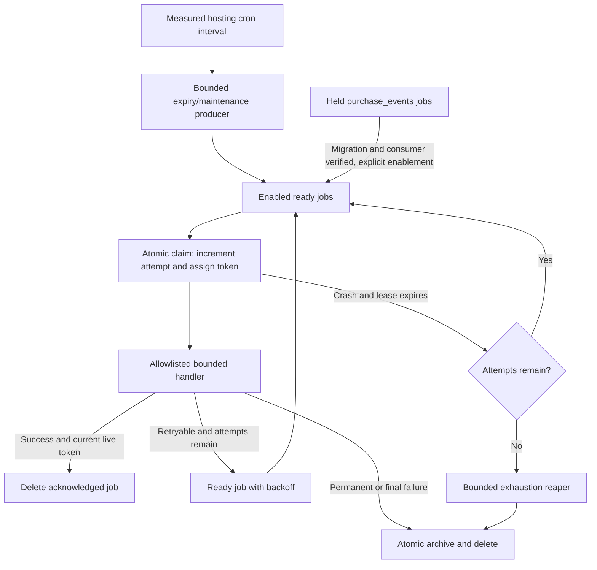

# 05 — Durable jobs, bounded workers, and recovery

This is an implementation guide, not working queue code. All schemas, SQL, filenames, CLI commands, and defaults marked **planned** below require implementation and verification. Use the canonical [plan](../implementation-plan.md), [tracker](../tracking.md), [shared contracts](../contracts.md), and [agent briefs](../agents.md). This guide covers `INF-01`, `INF-02`, and the queue portion of `ORD-02`; it does not authorize external delivery, deployment, production migrations, or optional integrations.

## Read the existing integration points

| Existing source | Observed behavior | Implementation consequence |
| --- | --- | --- |
| [`Website/vayu:29`](../../../Website/vayu#L29) | Dispatches help, `developer:create`, and development-server commands | Coordinator adds queue/maintenance commands before the unknown-command branch at [line 53](../../../Website/vayu#L53), while preserving existing dispatch |
| [`Website/vayu:35`](../../../Website/vayu#L35) | Developer CLI loads Composer, dotenv, env, config, PDO, and its specific class | Reuse the foundation CLI bootstrap contract; do not start an HTTP route, session, or view to process jobs |
| [`Website/config/db.php:31`](../../../Website/config/db.php#L31) | PDO throws on SQL errors; helpers use global `$pdo` | Explicitly inject/reuse this PDO for enqueue inside commerce transactions; never open another connection to enqueue an order job |
| [`Website/config/db.php:36`](../../../Website/config/db.php#L36) | Prepared-query helper returns a statement | Use prepared values; transaction ownership still belongs to the caller, not an implicit helper |
| [`Website/core/Mailer.php:9`](../../../Website/core/Mailer.php#L9) | Constructs PHPMailer with embedded SMTP configuration | Replace embedded configuration with validated environment settings before connecting real delivery; do not reproduce existing values in docs, fixtures, or logs |
| [`Website/core/Mailer.php:28`](../../../Website/core/Mailer.php#L28) | `send()` sends immediately and throws on failure | Invoke through an allowlisted notification handler outside the order transaction; add finite network timeouts and redact errors |
| [`Website/config/env.php:3`](../../../Website/config/env.php#L3) | Reads dotenv/server/process environment with a default | Use this accessor for queue limits and mail configuration after foundation bootstrap |
| [`Website/config/bootstarp.php:19`](../../../Website/config/bootstarp.php#L19) | Includes all core PHP files | Queue class loading must have no work-at-include side effects; coordinator owns loading new job/service dependencies |

`FND-01` must repair PDO/migrations/CLI before these tasks start. `INF-02` depends on integrated `INF-01`. `ORD-02` additionally requires integrated order/inventory contracts; do not invent stock rules in a worker. MySQL/MariaDB server features and cron limits come from `HST-01`, not from assumed hosting specifications.

## Planned file ownership and public contracts

| Planned artifact | Owner / purpose |
| --- | --- |
| `Website/core/Queue.php` | Queue specialist: validate/enqueue, claim, acknowledge, retry, archive failure; accepts a PDO and explicit queue configuration |
| `Website/app/Services/QueueService.php` | Queue specialist: application-facing typed enqueue helpers; no controller or session dependencies |
| `Website/app/Jobs/JobRegistry.php` | Queue specialist: explicit `(type, version)` handlers and their queue/deadline/validation policies |
| `Website/app/Jobs/OrderConfirmationJob.php` | Queue specialist after order contract is available: notification adapter |
| `Website/app/Jobs/ReservationExpiryJob.php` | Exclusively assigned ORD-02 author: calls InventoryService; never duplicates inventory arithmetic |
| `Website/database/migrations/<ordered-name>.php` | Assigned migration author; coordinator chooses filename/order and driver branches |
| `Website/tests/QueueTest.php`, `Website/tests/MySqlQueueTest.php` | Assigned test author: SQLite behavior and independent MySQL connections/processes |
| `Website/vayu`, CLI bootstrap, `.env.example`, tracker | Coordinator: specialist returns a concrete integration proposal |

Agree the following interface before callers are written: `enqueue(PDO, queue, type, version, payload, dedupeKey?, availableAt?)` returns an active job ID or an equivalent existing active ID; it neither commits nor rolls back a caller-owned transaction. Worker APIs accept a queue allowlist, a job-count limit, and a runtime limit. No API accepts an arbitrary PHP classname, executable payload, SQL fragment, or shell command.

## INF-01

### Planned database schema and envelope

Use InnoDB and explicit driver-specific migration SQL. The following is a schema specification, not a migration to paste into production. Epoch seconds below are **UTC database-clock values**, separate from ordinary commerce UTC datetime columns. MySQL reads `UNIX_TIMESTAMP()`; SQLite reads integer `strftime('%s','now')`. Never derive competing worker leases from differently synchronized host clocks. Use a monotonic process clock only for local runtime budgets.

| `jobs` column | Planned type / invariant |
| --- | --- |
| `id` | Driver-specific auto-increment integer primary key; unsigned BIGINT on MySQL |
| `queue`, `type` | Bounded ASCII identifiers; application allowlist; e.g. queue `emails`, type `order_confirmation` |
| `version` | Positive integer envelope version |
| `payload` | TEXT containing bounded JSON; baseline maximum 16 KiB, configurable downward |
| `status` | `ready` or `running`; enforce via application and supported database constraints |
| `attempts`, `max_attempts` | Initially 0 and a bounded positive policy value, proposed default 5 |
| `available_at`, `created_at` | Non-null epoch-second integers |
| `reserved_at`, `lease_expires_at` | Nullable epoch-second integers |
| `lease_token` | Nullable 64-character hex string from 32 cryptographically random bytes |
| `lease_owner` | Nullable bounded diagnostic worker ID; not an authorization credential |
| `dedupe_key` | Nullable unique ASCII/binary-collated key, bounded to 191 bytes |
| `last_error_code` | Nullable safe bounded classifier; no raw exception/provider response |

Ready rows have null lease fields. Running rows have a non-null token/owner/reservation/expiry. Add the requested `(queue, reserved_at, available_at)` index initially; measure `(queue, status, available_at, id)` and `(queue, status, lease_expires_at, id)` against the actual eligibility queries. Split ready/expired scans if the OR predicate has an unacceptable query plan. Do not prescribe all indexes without measuring their costs.

`job_failed` is a planned durable dead-letter table containing its own primary key, original job ID, queue/type/version/payload, attempts/max_attempts, dedupe key, original created time, failed time, safe error code, correlation ID, and nullable operator/retried-job metadata. Keep payload access restricted: even ID-only jobs can reveal customer activity. It is not an error log containing raw recipients, HTML email bodies, credentials, or stack traces. Keep retry history after a replayed job succeeds.

Example **planned JSON payload**, accompanied by row metadata `queue=emails`, `type=order_confirmation`, `version=1`:

```json
{"order_id":"123","notification_kind":"order_confirmation","correlation_id":"opaque-request-id"}
```

Store references rather than email addresses, prices supplied by browsers, or a rendered message. The handler loads the committed order snapshot and authorized recipient information. Validate exact supported keys/types/ranges and payload size when enqueuing and again when claiming. Malformed known-type payloads fail permanently; unknown type/version in an enabled queue is a deployment/configuration error, archived with visibility rather than executed dynamically.

An active-job unique dedupe key such as `order:123:confirmation:v1` prevents simultaneous duplicate pending jobs. It stops protecting that key once its job is acknowledged/deleted. Durable idempotency lives in the domain: checkout idempotency, unique inventory movement keys, deduplicated event keys, and a persistent notification delivery record when that handler is implemented. Do not describe the queue's unique key as permanent exactly-once protection.

## Enqueue with the business transaction

```mermaid
sequenceDiagram
    participant R as Checkout request
    participant D as Same PDO / MySQL
    participant C as Later cron worker
    participant P as Email provider
    R->>D: BEGIN; validate and lock stock
    R->>D: Write order, snapshots, idempotency and stock effects
    R->>D: INSERT notification job and purchase-event intent
    R->>D: COMMIT
    C->>D: Short claim transaction; assign token; COMMIT
    C->>D: Read committed order snapshot
    C->>P: Bounded send outside order transaction
    C->>D: Ack only current live lease
```

Enqueue inserts a `ready` row with zero attempts and null lease fields. Resolve duplicate active keys only when the existing job has equivalent queue/type/version/payload semantics; conflicting payloads are errors. Do not silently absorb unrelated unique-constraint failures. Order rollback must remove its newly enqueued job. Notification intent failure must cause the order transaction to roll back. Never call SMTP from checkout or start an inner transaction inside enqueue.

Before `EVT-01` exists, `ORD-01` stores type `purchase_event`, version 1 intent on a **held `purchase_events` queue**. Holding means excluding that queue from all worker selection allowlists, including exhaustion/unknown-handler scans. It is not a far-future `available_at` timestamp. Deployment activation requires the events migration, supported handler, durable purchase dedupe constraint, and a bounded backlog-replay test; only then enable the queue. Queuing purchase intent must not cause unregistered-handler retries during earlier milestones.

## INF-02

### Claim algorithm and lease eligibility

Define the same eligibility predicate in selection and conditional update:

```text
queue is explicitly enabled for this worker
AND available_at <= database_now
AND attempts < max_attempts
AND (
  status = ready AND lease_token IS NULL
  OR status = running AND lease_expires_at <= database_now
)
```

An attempt is consumed **once per successful claim**, before handler execution. A worker crash after claiming therefore consumes an attempt. Selection losses and SQL contention retries consume no attempt. An expired running job may be reclaimed with a new token if attempts remain; a row at its attempt limit is handled by the exhaustion reaper below, never left permanently invisible.

### Planned supported MySQL fast path

First verify `SKIP LOCKED` behavior against the actual MySQL/MariaDB target. Do not activate this query just because the configured driver is `mysql`. MySQL documents that it skips locked rows and is appropriate for queue-like tables, while returning an inconsistent view: use it to claim jobs, never to skip stock rows during checkout. [Official MySQL locking-read documentation](https://dev.mysql.com/doc/refman/8.4/en/innodb-locking-reads.html).

```sql
-- PLANNED: short transaction; bind enabled queue VALUES, never raw SQL.
SELECT id
FROM jobs
WHERE queue IN (?, ?)
  AND available_at <= ?
  AND attempts < max_attempts
  AND ((status = 'ready' AND lease_token IS NULL)
       OR (status = 'running' AND lease_expires_at <= ?))
ORDER BY available_at, id
LIMIT 1
FOR UPDATE SKIP LOCKED;

-- PLANNED: same transaction, selected row remains locked.
UPDATE jobs
SET status = 'running', attempts = attempts + 1,
    lease_token = ?, lease_owner = ?, reserved_at = ?, lease_expires_at = ?
WHERE id = ?;
```

Algorithm: begin; obtain fresh database time; select one row; if absent commit and stop/try another configured queue; generate a new token; update its lease to `now + lease_seconds`; load/return its envelope and new attempt number; commit. A failed update rolls back. Do not preclaim a batch that will sit idle consuming its lease while earlier jobs run. The worker does no handler I/O inside this transaction.

### Planned conditional-update fallback

Use for verified servers without `SKIP LOCKED`; SQLite behavior is a local check, not proof of MySQL concurrency. First select a bounded number of eligible candidate IDs without locks. For each candidate, generate a fresh token and get fresh database time, then execute this single prepared UPDATE in autocommit:

```sql
-- PLANNED: every placeholder has its own bound value.
UPDATE jobs
SET status = 'running', attempts = attempts + 1,
    lease_token = ?, lease_owner = ?, reserved_at = ?, lease_expires_at = ?
WHERE id = ?
  AND queue IN (?, ?)
  AND available_at <= ?
  AND attempts < max_attempts
  AND ((status = 'ready' AND lease_token IS NULL)
       OR (status = 'running' AND lease_expires_at <= ?));
```

Affected rows 1 means this token owns the claim; 0 means another worker won or eligibility changed. Retrieve with `WHERE id = ? AND lease_token = ?`; a missing/mismatched row is not a claimed job. Cap candidate retries and lock contention attempts; after the cap stop this invocation successfully with a contention metric rather than spin. Configure bounded engine lock waits. Test MySQL's actual conditional-update behavior using independent connections; MariaDB feature support is separately recorded. Prepared placeholder count is generated from queue-list length; an empty list exits without SQL. Repeated values have repeated positional parameters, avoiding unsupported repeated named placeholders with native PDO prepares.

### Lease duration and worker deadlines

Proposed initial local defaults: invocation runtime 30 seconds, handler deadline 10 seconds, lease 60 seconds, max 20 claimed jobs. They are tunable examples; enforce `lease_seconds > max(invocation_runtime, handler_deadline) + configured DB/ack allowance`, and reduce runtime/deadlines below verified hosting limits. A job may start only when enough invocation budget remains for its handler deadline plus acknowledgment. Set PHPMailer/provider connection and I/O timeouts below the handler deadline; an unbounded network call makes the worker runtime promise false.

Use `hrtime()` for elapsed-process budgeting and database time for leases. Check the runtime before claiming, before invoking, and between work units. A time budget alone cannot interrupt arbitrary PHP code: handlers must bound loops and I/O. Keep handlers short enough to avoid renewal initially. If renewal is added, use an atomic token-and-live-lease UPDATE, cap total runtime, and stop when renewal affects zero rows. A renewed token does not authorize starting a daemon.

## Ack, retry, and dead-letter transitions

All transitions verify both the token and a **currently live lease** using fresh database time. The worker ID alone never proves ownership. A stale worker must not delete, extend, overwrite errors, or reschedule a new owner's job.

```sql
-- PLANNED acknowledgment after successful effect.
DELETE FROM jobs
WHERE id = ? AND status = 'running' AND lease_token = ?
  AND lease_expires_at > ?;

-- PLANNED retry for a retryable failure while attempts remain.
UPDATE jobs
SET status = 'ready', available_at = ?, last_error_code = ?,
    reserved_at = NULL, lease_expires_at = NULL,
    lease_token = NULL, lease_owner = NULL
WHERE id = ? AND status = 'running' AND lease_token = ?
  AND lease_expires_at > ? AND attempts < max_attempts;
```

If the transition affects zero rows, report lease loss and do not try an unfenced fallback. Exponential retry policy: `delay = min(cap, base * 2^(attempts - 1)) + bounded_jitter`, with explicitly bounded base/cap/jitter. Attempts are already incremented; retry does not increment or reset them. Database outages cannot safely be recorded as successful acknowledgments; let the lease expire and recover on a later cron run.

For permanent failure or exhausted attempts: begin a short transaction; lock the row with the current token/live-lease condition; insert a sanitized `job_failed` snapshot; delete the same owned row; commit. If either operation fails, roll back both. Implement SQLite's lock approach explicitly rather than issuing `FOR UPDATE` there. This guarantees an archival error never destroys the only durable copy.

The **exhaustion reaper** scans enabled queues in indexed bounded batches for `attempts >= max_attempts` and either ready rows or running rows whose lease expired. For each row, lock/recheck current eligibility in a short transaction, archive with `attempt_limit_after_crash` when appropriate, then delete/commit. Its lock excludes simultaneous claim/ack changes; it must not archive a live lease or a held queue. The conditional fallback can lock/recheck using a short ordinary `FOR UPDATE` transaction on MySQL even when `SKIP LOCKED` is unavailable, with bounded lock waits.

Planned operator command `php vayu queue:retry --failed-id=<id>`: require local operator access; lock the failed record; validate supported envelope/queue and replay eligibility; create one ready job; record the returned job ID/operator/time in that failed record; commit. A duplicate command returns the already created replay ID. Retain the original failure record. A separate explicitly requested replay generation is needed for another retry after that replay fails; never silently reset all poison jobs. Held queues remain held after retry.

## Idempotent effects and the SMTP limit

For database-only effects, use a business transaction on the same PDO and the shared domain-first lock order in contracts.md: validate lease advisory state without taking a long queue-row lock, lock/apply the domain effect using its durable unique business key, then acknowledge as the final token-and-live-lease checked DELETE in that transaction. If DELETE affects zero rows or the lease cannot be proven live, roll back the domain effect. A reclaimer can change the token meanwhile, but it cannot cause an old worker to commit an unfenced effect; competing handlers serialize through domain locks/unique effect keys. Claims commit before handler execution. Never hold a queue-row lock and then wait for domain rows: synchronous order work locks domain rows before inserting/deduplicating jobs, so reversing the order could deadlock. Replayed effects find the durable key and return the prior result. Retry bounded transaction deadlocks with fresh facts. Do not hold this transaction open across SMTP or HTTPS.

Notification handlers load the committed order, validate its permitted notification state, render escaped templates, and use a planned delivery key `(order_id, notification_kind, version)`. Serialize competing send attempts using a short delivery-record claim/lease protocol and preserve an already-successful delivery record across queue deletion. Missing provider configuration is visible and must not report delivery success. Test through a fake sender first.

There is an unavoidable external boundary: SMTP may accept a message and the worker may crash before recording success. A later retry can deliver a duplicate. A stable Message-ID helps tracing but SMTP does not guarantee idempotent delivery. Finite timeouts and a sender lease reduce overlapping sends, but cannot fence an already-running network call. Never promise exactly-once mail or mark a notification sent before provider acceptance. Unknown outcomes follow documented retry/operator policy. Optional provider-side idempotency is used only when its actual API supports and verifies it.

Planned mail environment contract: `MAIL_HOST`, `MAIL_PORT`, `MAIL_USERNAME`, `MAIL_PASSWORD`, `MAIL_FROM_ADDRESS`, `MAIL_FROM_NAME`, `MAIL_ENCRYPTION`, `MAIL_TIMEOUT_SECONDS`. Validate required values when delivery is enabled; use no usable credential defaults. Replace embedded settings in the existing Mailer; historical credentials require operator rotation, not reproduction or automatic account changes. Failure logs store classifier, job/order IDs, attempt count, and correlation ID. Do not include raw PHPMailer `ErrorInfo`, message bodies, authentication settings, or full customer records.

## ORD-02

### Reservation cleanup, scheduling, and recovery

`ORD-02` cleanup follows the order/inventory state machine. Expired reservations cannot be accepted by checkout just because cron has not yet released their counters. Cart creation does not reserve stock. For the queue portion:

1. A planned bounded maintenance command scans reservation IDs with `state='active' AND expires_at <= database_now`, using `(state, expires_at, id)` where supported/measured. It never loads the entire table.
2. Enqueue ID-only expiry jobs with active dedupe key `reservation:<id>:expire:v1`, committing each bounded batch. Repeated scans are safe; do not create a permanent dedupe record that prevents retries after failed execution.
3. The handler uses InventoryService to lock the reservation and related stock rows in the agreed order, recheck state/expiry/ownership, release reserved quantities once, create a uniquely keyed movement, and advance durable cache version metadata in the same effect transaction. Already consumed/released/expired reservations are successful no-ops.
4. Cancellation and fulfillment stay synchronous domain decisions. Jobs perform deferred release/notifications only where the domain contract allows it; no worker decides to cancel a valid order solely from a stale listing.
5. Low-stock work recomputes authoritative stock and uses a durable alert policy/key so repeated scans do not spam. Cache warmups are optional and never required for stock correctness.

The maintenance producer itself needs a runtime/batch cap and safe overlap behavior. Overlapping producers rely on unique active enqueue keys; overlapping consumers rely on leases and durable movement keys. Catch-up uses repeated small runs rather than increasing an invocation beyond the hosting limit.



Planned local examples, unusable until CLI integration is implemented:

```text
php vayu queue:work --queues=emails,maintenance --max=20 --max-seconds=30
php vayu maintenance:reservations --max=100 --max-seconds=20
php vayu queue:retry --failed-id=123
```

Use actual absolute PHP/script paths in the deployment runbook and an operator-configured cron interval. Missing cron access is a recorded hosting prerequisite; it does not justify a public GET worker. If CLI is unavailable, follow the plan's separate reviewed authenticated POST worker design. Queue choice must not depend on whether Redis is present. Monitor pending count/oldest age, held backlog, active/expired leases, failure count, retry rates, and jobs drained per bounded invocation. Exit success for no work or lost candidate contention; exit nonzero for configuration/bootstrap/database failures without printing secrets.

## Verification vectors and completion evidence

Run syntax/behavior checks after implementation. Record actual commands, PDO/PHP/server versions and outcomes in the tracker. No proposed test filename here is evidence that it exists or passes. MySQL-specific checks must use disposable MySQL/MariaDB databases and independent connections/processes; SQLite cannot close locking criteria.

| Vector | Required outcome |
| --- | --- |
| Enqueue inside transaction, then rollback | No new job survives; committed order and notification intent cannot separate |
| Two workers select the same fallback candidate | Exactly one UPDATE wins; attempts increment once; loser executes nothing |
| Two fast-path workers, multiple ready rows | Supported `SKIP LOCKED` prevents both receiving the same live token; no long handler transaction holds queue locks |
| Crash immediately after claim | Attempt remains consumed; expired lease is reclaimed with a new token |
| Old worker acknowledges after new claim | DELETE affects zero rows; new owner's job remains intact |
| Old worker retries/renews after lease loss | UPDATE affects zero rows; new token/availability/error remain intact |
| Crash on final permitted attempt | Exhaustion reaper archives/deletes once; job does not remain permanently running |
| Permanent invalid payload | No dynamic execution; one sanitized failed record; queue remains drainable |
| Dead-letter insert fails | Transaction rollback preserves active job |
| Duplicate operator retry | One replay row, stable returned ID, original failure retained |
| Retried DB inventory release | Unique movement/effect key prevents double release; counters and cache version match committed effect |
| Held purchase intent before EVT consumer | No claim, attempt increment, unknown-handler failure, or dead-letter; later enablement drains bounded backlog |
| SMTP succeeds then worker crashes | Test exposes possible duplicate; documentation and delivery policy do not claim exactly-once |
| SMTP unavailable or credentials absent | No order rollback after commit, no false sent marker, bounded timeout/retry/failure visibility |
| Worker starts near runtime budget end | Does not claim a job lacking execution/ack budget; finite invocation ends within measured allowance |
| Redis absent/down | Queue ownership, retries, inventory effects, and order durability unchanged |
| Concurrent expiry/fulfillment/cancel | Only a permitted state wins; no negative reserved quantity, double movement, or canceled fulfilled effect |

`INF-01` closes only after schema/enqueue/validation/dedupe/rollback behavior is demonstrated. `INF-02` closes only after both selected claim strategy and crash/lease/retry/runtime/failure behavior pass on the supported target, with provider delivery clearly pending if unavailable. Queue portions of `ORD-02` close only with domain concurrency/replay checks and bounded producer evidence. The coordinator owns final integrated statuses; return proposed evidence and pending external checks.
