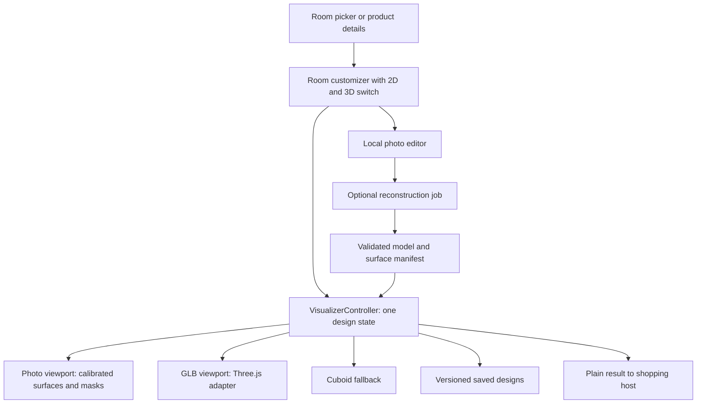

# Room visualizer: 2D, better 3D rooms, and uploaded rooms

Prepared: 4 October 2026. Status: **Milestones A & B implemented and tested**; Milestones C–F remain future phases.

The separate product-card correction is implemented: a 2px image inset, no blue backing, no added shadow, full-image fitting, and the same card geometry as before this correction. Image dimensions never determine card dimensions. Brand names and the home deal carousel remain intact.

## 1. Recommended delivery order

1. Put **3D View / 2D View** inside the existing room customizer, backed by one design state. Fix saved-design restoration during this work.
2. Deliver preset photo tiling and local photo import with manual surface marking. This provides a useful feature without an AI service.
3. Prove one furnished GLB room with independent floor/wall replacement, then prepare six coordinated room presets. Each preset gets a matching 2D image from the same scene.
4. Add an asynchronous **photo → approximate 3D room** pilot with editable surfaces, explicit dimension calibration, and a 2D fallback.
5. Add video reconstruction only after the photo workflow and processing costs have been validated.

The copied proposal is directionally useful, but replacing the renderer and preparing editable room assets is substantial work. A general image-to-3D service is not automatically a room reconstruction service. A single photo does not reveal hidden geometry or supply trustworthy measurements.

## 2. What this repository already has

Paths below link to existing code; proposed paths are listed separately later.

| Existing code | Current behavior | Planned change |
|---|---|---|
| [VisualizerEntryScreen](../Mobile/lib/features/visualization/visualizer_entry_screen.dart) | Room picker titled “3D Room Preview” | Rename to “Room Visualizer”; add preset/import entry points |
| [RoomCustomizerScreen](../Mobile/lib/features/visualization/room_customizer/room_customizer_screen.dart) | Owns assignments, camera, selected surface, comparison and save controls | Move design state into a shared controller; switch viewports within this page |
| [CuboidRoomRenderer](../Mobile/lib/features/visualization/rooms/cuboid_room_renderer.dart) | Flutter painter with subdivided textured surfaces | Keep as lightweight fallback during GLB migration |
| [RoomRenderer](../Mobile/lib/features/visualization/rooms/room_renderer.dart) | Interface uses `RoomScene`, decoded `ui.Image`, synchronous projection and Flutter snapshot | Add a separate asset-based viewport contract; the current interface is not enough for a WebView implementation without adaptation |
| [RoomSceneBuilder](../Mobile/lib/features/visualization/rooms/room_scene_builder.dart) | Builds known cuboid planes, fixed lighting factors and hotspots | Retain for fallback; GLB scenes load through a new adapter |
| [Room and RoomSurface](../Mobile/lib/data/models/room.dart) | Dimensions, surface IDs, area, texture defaults and hotspots | Add preset asset metadata and an explicit surface mapping |
| [Current presets](../Mobile/lib/data/static/static_rooms.dart) | Seven rooms: living, kitchen, bathroom, bedroom, lobby, office and villa | Improve asset quality rather than simply adding more cuboids |
| [MarbleTexture](../Mobile/lib/data/models/marble_texture.dart) | Color image, glossiness and repeat size | Add optional PBR maps and physical tile dimensions |
| [SavedDesign](../Mobile/lib/data/models/saved_design.dart) | Stores room ID and surface-to-product assignments | Versioned persistence for mode, surface settings, photo calibration and camera |
| [SavedDesignsScreen](../Mobile/lib/features/visualization/saved_designs_screen.dart) | Opens only `VisualizerArgs(roomId: ...)` | Pass design ID and restore assignments; currently reopening loses the saved material selections |
| [VisualizerArgs](../Mobile/lib/core/routing/routes.dart) | Only room/product IDs | Add design ID and optional initial mode |
| [RoomRepository](../Mobile/lib/data/repositories/repositories.dart) and [StaticRoomRepository](../Mobile/lib/data/repositories/static_repositories.dart) | Presets/textures and locally persisted designs | Keep local workflow; introduce a separate reconstruction repository later |
| [Module bridge](../Mobile/lib/core/bridge/module_bridge.dart) | Defines plain visualizer-to-shopping results | Preserve this contract; move current direct cart access in `_addToCart` to a host handler |
| [API gateway](../Website/api/gateway.php) | No reconstruction endpoints | Add authenticated job endpoints in the backend phase |

Additional findings:

- `_apply` and `_toggleOriginal` already replace textures on individual surfaces. Reuse this behavior through the controller.
- `_share` captures a renderer image and opens an in-app sheet. Actual file export/system sharing needs a platform export service.
- There is no photo selection, perspective surface editor, GLB loader, inference worker or reconstruction API in the reviewed implementation.
- Dependencies currently do not include a GLB/WebView renderer or image picker. Adding tabs alone will not supply these capabilities.

## 3. Proposed screen

```text
Room Visualizer                 Save   Share
Modern living room                     Change

       [ 3D View ] [ 2D View ]
┌──────────────────────────────────────────┐
│                                          │
│   Same room and materials in either view  │
│                                          │
│   Before / After                 Reset    │
└──────────────────────────────────────────┘
[Floor] [Feature wall] [Left wall] [Counter]

Selected stone · brand · price
[Choose stone]
Tile size   Rotation   Grout width / color
[Save design]                 [Use this stone]
```

Use a segmented control rather than swipe navigation: horizontal gestures already rotate/pan the room. On a narrow phone, surface choices scroll horizontally and advanced controls expand in a bottom sheet. Do not let the controls cover the surface being edited.

Behavior:

- Product details still opens the visualizer with that product applied to the floor.
- Mode changes preserve room, assignments, selected surface, scale, rotation, grout and before/after state. Each mode remembers its own camera/zoom.
- “2D View” means photo-based visualization, not a top-down floor plan.
- Presets with both assets switch immediately after loading. A preset with only one asset displays the other mode as unavailable with a short explanation.
- An imported photo starts in 2D. The 3D option offers “Create 3D preview” only once the reconstruction service is available. Do not present a flat image as a completed 3D reconstruction.
- Changing room maps compatible floor/wall choices explicitly. Unmatched surfaces get defaults; preserve the previous room's draft.
- Save and Share capture the active view. Before/after never overwrites the saved edited assignments.

## 4. Shared state and rendering architecture



Keep renderer objects and decoded images out of persisted state. Store stable room, product, surface and asset IDs. Resolve product → texture using the existing texture ID relationship.

Proposed core records:

| Record | Fields |
|---|---|
| `VisualizerState` | mode, source/preset ID, active surface, assignments, baseline assignments, compare flag, per-mode camera/zoom |
| `SurfaceStyle` | product ID, tile width/height in metres, rotation, grout width in millimetres, grout color |
| `RoomAssetManifest` | version, model asset, photo asset, surface bindings, camera presets, units, bounds, source/license metadata |
| `PhotoSurface` | stable surface ID, ordered normalized corners, optional boundary polygon, occlusion mask, physical calibration |
| `SavedDesignV2` | schema version, source reference, assignments/styles, last mode, cameras, imported photo reference, masks/calibration, thumbnail |
| `ReconstructionJob` | ID, state, stage, source asset ID, timestamps, failure code, result manifest ID, quality flags |

Use a `ChangeNotifier` controller to fit the existing Flutter architecture. Protect asynchronous texture changes with an operation revision so a slow older selection cannot overwrite a newer one. Load the inactive renderer lazily, stop its rendering when hidden, and replay the latest state when it becomes ready.

### Dart reference sketch

This illustrates the proposed ownership, not a ready-to-paste implementation. `VisualizerController`, `PhotoRoomViewport` and `ModelRoomViewport` are new types.

```dart
enum VisualizerMode { threeD, twoD }

// One controller is created by the screen and disposed with it.
ListenableBuilder(
  listenable: controller,
  builder: (context, _) => Column(
    children: [
      SegmentedButton<VisualizerMode>(
        segments: const [
          ButtonSegment(
            value: VisualizerMode.threeD,
            label: Text('3D View'),
          ),
          ButtonSegment(
            value: VisualizerMode.twoD,
            label: Text('2D View'),
          ),
        ],
        selected: {controller.state.mode},
        onSelectionChanged: (selection) =>
            controller.setMode(selection.single),
      ),
      Expanded(
        child: controller.state.mode == VisualizerMode.twoD
            ? PhotoRoomViewport(controller: controller)
            : ModelRoomViewport(controller: controller),
      ),
    ],
  ),
);
```

In production, `setMode` checks availability; viewport lifecycle code retains/restores camera state and releases GPU resources. The controller survives viewport replacement. Extend `VisualizerArgs` with `designId`; load a saved design before applying any explicitly supplied product override. Migrate old assignment-only saves with default styling and 3D mode.

## 5. Phase 1A: useful 2D room visualization

### Preset photos

Prepare one photo/render for every supported room, with floor/wall corner calibration and foreground masks. Prefer renders exported from the eventual GLB scene so the two modes depict the same furniture and proportions. Existing previews can be used for the prototype, but they need annotation before tiling works.

### Imported photo workflow

1. Select or capture a room image through a platform image-source service. Normalize orientation, downsample for rendering, and copy it into durable app storage.
2. Select Floor or Wall and mark four corners in a consistent order. Support dragging points, undo/reset, and invalid-quadrilateral feedback.
3. Add a foreground exclusion mask so furniture and fixtures are not painted over. Supply an erase/restore brush initially; automatic segmentation can follow later.
4. Choose a material and adjust pattern scale/rotation/grout. Ask for a known length or dimensions when real tile size or area is needed.
5. Save the design locally; export the composed image.

Render a repeated tile field in plane coordinates, then apply the plane-to-photo homography. Clip to the surface boundary and subtract occlusions. Keep normalized annotations in source-image coordinates; account for letterboxing and zoom when converting touches. Reject self-crossing or near-zero-area corner sets.

For a Flutter prototype, subdivided textured triangles can approximate the projective mapping, following the existing cuboid painter approach. Plain four-corner affine stretching is insufficient for strong perspective. Establish image-based error tests and increase subdivision or move to a shader if seams/distortion remain. Blend lighting conservatively; a basic overlay does not recreate lighting automatically.

**Exit criteria:** imported image survives restart; floor and wall styles stay independent; furniture masks remain intact; controls persist across mode switches; no false area estimate without calibration; canceled imports leave the current design untouched.

## 6. Phase 1B: better furnished 3D rooms

### Renderer choice

Recommendation: prototype a **bundled Three.js viewer**, embedded through a platform adapter, for the furnished-room editor. This is an engineering recommendation based on the need for arbitrary mesh selection and per-surface materials. Three.js provides a [glTF loader](https://threejs.org/docs/pages/GLTFLoader.html) and [PBR material support](https://threejs.org/docs/pages/MeshStandardMaterial.html).

`model_viewer_plus` remains a candidate for a simpler model display, but the room editing spike must prove all material/selection requirements before adopting it. Its listed platforms are Android, iOS and web. [Package documentation](https://pub.dev/packages/model_viewer_plus)

Platform plan:

| Target | Proposed implementation |
|---|---|
| Android/iOS | Local bundled viewer through `webview_flutter`; validate gestures, asset loading and screenshot export on devices |
| Flutter web | Same viewer bundle in a web element/iframe adapter, with a validated message bridge |
| Linux/Windows | Keep the existing cuboid and Flutter 2D paths initially; a desktop WebView/GPU adapter is a separate deliverable |

Do not assume `webview_flutter` works on every Flutter target: its current package lists Android, iOS and macOS. [Official plugin documentation](https://pub.dev/packages/webview_flutter)

Bundle a pinned viewer build and required decoders instead of relying on a runtime CDN. Verify local URL/origin handling for GLB, textures, HDRI and WASM in the initial device spike.

### Asset specification

Start with modern living room, bedroom, kitchen, bathroom, dining room and office. Balcony can follow. Keep the current lobby/villa available until replacements are ready.

Every accepted room must include:

- A GLB using metres, documented axes and camera bounds; furniture should frame the tileable surfaces rather than hide them.
- Independently selectable floor/wall/counter meshes with UVs and stable IDs such as `floor`, `wall_back`, `wall_left`, `wall_right`, `counter`.
- A surface manifest mapping each ID to one or more mesh names. Clone shared materials before changing one surface.
- PBR materials, a restrained lighting setup, environment illumination and tested shadows. Calibrate roughness per stone rather than equating current glossiness directly to a realistic material.
- Matching 2D render, surface annotations and masks; preview thumbnail; source/license record.
- Mobile optimization. Initial targets, to be measured: 50–150k visible triangles, 1K/2K textures, roughly 5–15 MB per room, sustained 30 fps on the selected mid-range reference device. These are engineering budgets, not measured results.

Prove one living room first. Do not procure six assets until the first room passes tile replacement, camera, performance and export checks. A marketplace model with baked floors and merged materials needs artist preparation even if it looks good in a screenshot.

Sources: [Poly Haven](https://polyhaven.com/) for models, materials and HDRIs, plus artist-prepared or commercially licensed room scenes. Poly Haven assets are published under CC0; its asset license should not be confused with terms for using its hosted API. [Asset license](https://polyhaven.com/license)

### Three.js material reference sketch

The following assumes the model's tileable plane has 0–1 UVs matching manifest dimensions. UV conventions and units must be validated during asset preparation.

```js
// THREE, mesh, loadedColorTexture, style and surface come from the viewer.
const material = mesh.material.clone(); // isolate this surface
const color = loadedColorTexture.clone(); // isolate repeat/rotation
color.colorSpace = THREE.SRGBColorSpace;
color.flipY = false; // texture assigned to a glTF material
color.wrapS = color.wrapT = THREE.RepeatWrapping;
color.repeat.set(
  surface.widthMetres / style.tileWidthMetres,
  surface.heightMetres / style.tileHeightMetres,
);
color.center.set(0.5, 0.5);
color.rotation = style.rotationDegrees * Math.PI / 180;
color.needsUpdate = true;
material.map = color;
material.metalness = 0;
material.roughness = style.roughness;
material.needsUpdate = true;
mesh.material = material;
```

Grout needs its own pattern/shader treatment using the same physical units in both renderers. Match texture transforms on normal/roughness maps when present. Dispose replaced resources safely; do not dispose textures still shared by other surfaces. Texture repeat requires wrapping settings, as described in the [Three.js texture reference](https://threejs.org/docs/pages/Texture.html).

Bridge commands: `loadRoom`, `applySurfaceStyle`, `setCamera`, `setComparison`, `capture`, `dispose`. Events: `ready`, `surfaceSelected`, `cameraChanged`, `captureReady`, `error`. Include request IDs and state revisions; validate message payloads and asset origins. Export inside the viewer rather than assuming a Flutter `RepaintBoundary` captures a WebView.

## 7. Phase 2: photo → approximate editable 3D

Goal: recover useful room planes and a restricted viewpoint from a photo, then allow floor/wall replacement. Hidden geometry is inferred. Do not promise a complete scanned room or accurate quantities.

Pipeline:

```text
Photo + optional measured reference
  → upload validation and normalization
  → depth estimate + surface/foreground segmentation
  → camera/layout estimate + plane fitting
  → user confirmation/correction of boundaries and scale
  → room mesh + projection textures + semantic surface manifest
  → quality validation and optimized assets
  → editable 3D preview, with the original 2D design retained
```

A depth model is one component. Depth Anything V2 provides depth estimation, not the complete plane editor, mesh generation or room semantics. Its Small model uses Apache-2.0; the larger listed models use CC-BY-NC-4.0. Check the exact checkpoint before commercial deployment. [Official repository](https://github.com/DepthAnything/Depth-Anything-V2)

A cloud provider should be selected through a benchmark, not name recognition. Meshy's API documents image-to-3D tasks and model outputs; that does not establish faithful room dimensions or independently editable walls. Treat it as a candidate to evaluate, not a committed room-reconstruction solution. [Meshy API](https://docs.meshy.ai/en/api/image-to-3d)

Evaluate candidate services/custom inference on a representative, permissioned room-photo set. Measure floor/wall identification, geometry consistency, furniture occlusion, tile replacement, failed jobs, turnaround, per-success cost and deletion support. Include blank walls, reflective marble, small rooms and furniture-heavy scenes. If a provider produces only a merged decorative mesh, it fails this use case. Keep the provider behind a replaceable server adapter; no API credentials in Flutter.

### Proposed backend contract

These routes do not exist yet. Register them through the project's API gateway and controller conventions.

| Route | Purpose |
|---|---|
| `POST /api/visualizer/uploads` | Create an owned upload record and upload instructions |
| `POST /api/visualizer/reconstructions` | Create an idempotent job from an uploaded asset and calibration |
| `GET /api/visualizer/reconstructions/{id}` | Return state, stage, error or result manifest |
| `POST /api/visualizer/reconstructions/{id}/cancel` | Request cancellation; distinguish request from confirmed cancellation |
| `DELETE /api/visualizer/reconstructions/{id}` | Delete owned inputs/results subject to declared retention behavior |

Job states: `queued → processing → needsReview → ready`, plus `failed`, `cancelRequested`, `canceled`. UI shows real stage updates; use indeterminate progress if the worker cannot report a meaningful percentage. Resume polling after app restart; use bounded backoff and retryable failure codes.

PHP handles authentication, ownership and job metadata. Object storage holds uploads/results. A queue and separate inference worker handle processing; do not run a long reconstruction in an HTTP request. Validate upload content/size, remove unnecessary photo metadata, scope result access to the owner, enforce job limits and expose deletion. Retention and processing charges must be defined before launch.

For ordering, uncalibrated photos cannot produce a purchase quantity. Ask for a measured area or route to the calculator; keep visual selection separate from confirmed quantity.

## 8. Phase 3: video → room reconstruction

Begin only when demand and infrastructure justify it. Guided capture should encourage overlapping views, a slow path, stable lighting and a static room. Reflective/textureless stone surfaces remain difficult inputs.

Process video into selected sharp frames, estimate camera poses, reconstruct geometry, extract editable room planes, then optimize the scene. Photogrammetry tools such as COLMAP provide reconstruction stages but are not a finished room editor. [COLMAP tutorial](https://colmap.github.io/tutorial.html)

Gaussian splats may be useful for a realistic walkthrough, but the app still needs a separate surface representation for changing tiles and measuring area. Do not promise arbitrary material replacement on a raw splat. Reuse the photo job infrastructure with video-specific limits and quality checks.

## 9. Proposed file changes

New paths are design proposals, not files created in this task.

```text
Mobile/lib/features/visualization/
  state/visualizer_controller.dart
  state/visualizer_state.dart
  widgets/view_mode_switch.dart
  widgets/surface_controls.dart
  photo/photo_room_viewport.dart
  photo/photo_surface_editor.dart
  photo/perspective_mapper.dart
  photo/occlusion_editor.dart
  photo/photo_source_service.dart
  model/model_room_viewport.dart
  model/viewer_bridge.dart
  model/viewer_platform_*.dart
  reconstruction/reconstruction_screen.dart
  reconstruction/reconstruction_controller.dart
  export/design_export_service.dart

Mobile/lib/data/models/
  room_asset_manifest.dart
  photo_surface.dart
  reconstruction_job.dart
Mobile/lib/data/repositories/reconstruction_repository.dart
Mobile/assets/visualizer/                 # bundled viewer build
Mobile/assets/rooms/<room-id>/             # GLB, photo, manifest, masks

Website/app/bridge/Visualizer.php          # proposed API controller
Website/database/migrations/...           # uploads/jobs/results metadata
Services/room_reconstruction/              # proposed worker; new deployment
```

Modify existing `room_customizer_screen.dart`, `visualizer_entry_screen.dart`, `saved_designs_screen.dart`, `routes.dart`, `router.dart`, room/texture/saved-design models, repositories and dependency wiring. Update `pubspec.yaml` only as each capability is implemented. Select compatible package versions during the spike, then pin/test them.

## 10. Delivery milestones and validation

Rough engineering estimates for one experienced developer, excluding asset acquisition/artist time and external review; refine after the first rendering spike.

| Milestone | Deliverable | Status | Acceptance |
|---|---|---|---|
| A | Shared state, mode UI, saved-design restore, room change & share sheets | **Completed & tested** | Switching/reopening preserves selections; room switching & share sheet work |
| B | Preset and uploaded-photo 2D editor | **Completed & tested** | Calibrated perspective, masks, local persistence, photo upload entry point |
| C | One GLB room and device renderer spike | Next phase (5–8 days) | Independent surfaces, camera limits, offline load, export, performance |
| D | Six matched 2D/3D presets | 5–10 integration days after assets are ready | Every room passes the same asset and visual checks |
| E | Photo reconstruction pilot | 3–6 weeks after provider/worker feasibility | Usable editable planes, bounded failures, resumable jobs, honest measurements |
| F | Video pilot | Estimate after photo pilot | Stable capture/reconstruction benchmark and acceptable processing cost |

Testing should cover:

- Homography/corner validation, image-coordinate conversion and mask composition.
- Assignment persistence across modes, rapid texture-change races, and old saved-design migration.
- Physical repeat/rotation/grout consistency between 2D and 3D.
- Narrow screens, large text, dark mode, interrupted imports, offline presets and unsupported-renderer fallback.
- Real Android/iOS/Web interaction and export; widget tests alone cannot validate WebGL quality or GPU memory.
- Worker timeout/retry/cancel, duplicate submissions, ownership, restart recovery and missing/deleted assets.
- Manual visual review of every furnished room, especially floor/wall junctions, UV scale, furniture occlusion and reflective finishes.

Existing regression references: [room_renderer_test.dart](../Mobile/test/room_renderer_test.dart), [module_boundaries_test.dart](../Mobile/test/module_boundaries_test.dart), [repositories_test.dart](../Mobile/test/repositories_test.dart), [stone_design_test.dart](../Mobile/test/stone_design_test.dart), and [visualizer_views_test.dart](../Mobile/test/visualizer_views_test.dart).

## 11. Review decisions before implementation

Recommended defaults for review:

1. Ship shared 2D/3D state and manual photo tiling first (Milestones A & B); keep reconstruction out of that release.
2. Target furnished GLB rendering on Android, iOS and web first, with the existing desktop fallback.
3. Approve the first room's appearance and editing behavior before acquiring/preparing the remaining five.
4. Choose an asset budget and reference devices for the rendering spike.
5. Select an AI service only after benchmark results, recurring cost and data-retention terms are reviewable.

Milestones A & B are fully implemented and verified with automated widget and unit tests ([visualizer_views_test.dart](../Mobile/test/visualizer_views_test.dart)). Future milestones (C–F) await GLB asset modeling and backend reconstruction service spikes.
