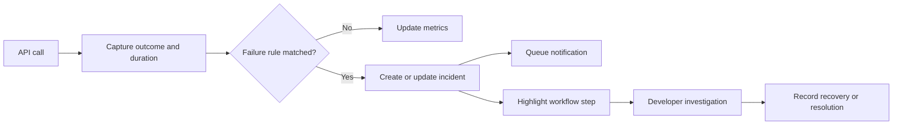
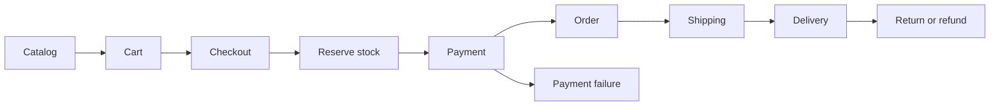

# Vayu Ecommerce and Developer Console Plan

Status: dedicated developer login, eight console pages, persisted account permissions, and read-only runtime endpoint implemented. API traffic collection, normalized application-wide RBAC, incidents, alerts, and business traces remain planned.

## Current compact delivery

- The landing page displays a Maa Sarada welcome message.
- `/developer` redirects signed-out users to `/developer/login`. Authenticated accounts see the overview; the console has eight independently addressable pages. One controller and one shared view use shared CSS/JavaScript assets without chart libraries or build dependencies.
- `DEVELOPER_ENABLED=false` in environment configuration removes both console routes and skips loading its controller. The flag is defined in `config/config.php` and defaults to true.
- Console identities are stored separately in `developer_accounts`, with hashed passwords, an allowed role, enabled state, and explicit JSON permission assignments. Authentication stores only the console account ID; current role, enabled state and permissions are fetched on each request. Page-specific permissions also gate server/API fields in the metrics response. Anonymous HTML requests redirect to login; anonymous JSON requests return 401; insufficient page permissions return 403. Customer sessions grant no developer access. Login uses CSRF checks, session ID rotation, a 30-minute inactivity limit, and persistent direct-client-IP throttling (five attempts per 15 minutes). Logout is POST-only and requires CSRF.
- Five-second polling updates runtime values without page reload, pauses in hidden tabs, supports manual pause, and reports connection failures. Supported hosts expose one-minute load average; PHP memory is request memory, not host memory. CPU, host memory, real API counts, failure rates, and module health require collectors.
- An explicitly labeled sample preview demonstrates moving traffic counts and the chart. The commerce graph and endpoint list are design definitions, not measured execution or automatically discovered commerce APIs.

## Next implementation sequence

### Delivered page designs

| Page | Current design and interaction | Next data integration |
| --- | --- | --- |
| Overview | Cards, throughput chart, runtime snapshot, dependency map, endpoint watch, recent activity | Traffic aggregation and module observations |
| API registry | Search by path/module/permission, module filter, pagination, endpoint detail dialog, actual registered routes and labeled planned contracts | Method/permission metadata, request history, percentiles, failure rate |
| Server load | Real supported load-average samples and bounded chart history, request memory, infrastructure collector status | Host CPU/memory/disk, workers, database and queue measurements |
| Module flows | Selectable commerce nodes, module details, zoom/reset, explicit planned dependency and unknown health states | Trace correlation, dependency edges, failure overlays, module throughput |
| Incidents | Empty/unconnected state; labeled sample inbox with severity and state filtering | Fingerprints, lifecycle actions, recovery checks, notifications |
| Live activity | Bounded event stream, pause/resume and clear-visible controls | Sanitized API events, audit actions and job observations |
| Roles & permissions | Current role/account and explicit granted/denied page permissions | Role management, user assignment and audited permission changes |
| Settings | Effective read-only configuration and collector roadmap | Validated threshold/retention/alert settings with mutation permissions |

The shared shell highlights the current page, hides inaccessible navigation entries, supports mobile navigation, and provides visible disconnected/paused states. Tables use local filtering and ten-row pagination now; replace this with server-side pagination as the registry grows. Preview values are explicitly simulated and never written to monitoring storage. Preview traces do not imply real execution, and sample events are removed on leaving preview mode.

### Local account setup

From `Website`, run `php vayu developer:create your@email.com`, then enter a password of at least 12 characters at the prompt. Input is currently visible in the CLI. The command initializes only the two dedicated console tables and inserts a new enabled developer account with all current read permissions; it does not grant customer accounts access. Duplicate emails fail rather than replacing credentials. SQLite and MySQL table creation are supported; MongoDB console authentication is not implemented.

Run `php vayu run` and open `/developer/login`. No account is automatically created during page requests, and no default credentials are included. Account editing/recovery and normalized role-permission assignments are subsequent work. The configuration flag removes login, logout, all console pages, and the metrics API when disabled.

Run `php tests/DeveloperAccessTest.php` for isolated authentication checks. Desktop/mobile previews are saved in `Docs/previews/`; overview previews deliberately use labeled simulated traffic.

1. Centralize database-backed roles, permissions, role-permission links, and user-role assignments. Check account state and current permissions on every protected request; distinguish customer ownership checks from role permissions. Route metadata will declare method and permission requirements for all APIs and protected pages.
2. Register module and endpoint metadata; capture incoming/outgoing requests, timing, outcomes, and request/trace IDs. Replace preview counters and endpoint rows with observed data.
3. Add a scheduled host collector for CPU, host memory, active workers, database health, and disk usage. Persist bounded history and serve time-window aggregates. Use external availability checks for server outages.
4. Connect module counts and correlated traces to the flow visualization; show unknown, degraded, and failing states. Add incident grouping and asynchronous alerts.
5. Introduce server-sent events if polling cost or latency warrants it; keep permission checks, reconnect handling, bounded buffers, and a polling fallback.

Implemented read permissions: `developer.view`, `monitor.apis.read`, `monitor.server.read`, `monitor.workflows.read`, `monitor.incidents.read`, `monitor.events.read`, `monitor.access.read`, and `monitor.settings.read`. Mutation permissions and customer commerce permissions remain future work.

Date: 2026-10-02

## Objective and scope

Prepare Vayu for ecommerce applications and provide a protected developer console at `/developer`. The console will monitor API failures, application errors, and registered business workflows. An interactive knowledge tree will explain the framework; a workflow graph will connect module dependencies to recorded execution and health.

The first delivery is the developer console and monitoring foundation. Building a complete storefront, payment integration, and store administration is subsequent work. Planned modules must be visibly distinguished from implemented modules.

## Current framework

Vayu provides frontend routes in `app/view.php`, API routes in `api/gateway.php`, controllers in `app/bridge/`, views in `app/page/`, and reusable helpers in `core/`. Configuration uses environment values. SQL database helpers use PDO, with SQLite configured for local development.

There is an existing customer `core/Auth.php`. Dedicated console authentication now lives in `core/DeveloperAccess.php` and does not reuse customer accounts. Accounts are explicitly provisioned through the CLI; no default developer password is seeded.

The outgoing API helper currently returns response content without consistently classifying HTTP failures. The route dispatcher lacks explicit HTTP method enforcement and developer access guards. Migration execution must be reviewed and repaired before introducing monitoring tables.

## Ecommerce capability map

| Module | Intended capabilities |
| --- | --- |
| Catalog | Products, categories, variants, images, search |
| Inventory | Stock quantities, reservations, low-stock alerts |
| Customers | Registration, login, addresses, account history |
| Cart | Guest and customer carts, quantities, saved carts |
| Checkout | Addresses, delivery options, taxes, coupons, totals |
| Payments | Gateway integration, verified webhooks, payment reconciliation |
| Orders | Order creation, status history, invoices, cancellations |
| Fulfilment | Shipping integration, tracking, delivery status |
| Returns | Return requests, refunds, stock adjustments |
| Store administration | Catalog management, orders, customer support |
| Developer Console | Monitoring, incidents, graphs, operational activity |

Each module has an implementation state and a separate health state. An unimplemented or unobserved module must not appear healthy by default.

## Developer access and routes

Visiting `/developer` redirects unauthenticated visitors to `/developer/login`; authenticated, authorized developers see the overview at `/developer`. `/developer/overview` is also supported. Session expiry redirects HTML visitors back to login; the data API returns 401.

| Route | Purpose |
| --- | --- |
| `/developer/login` | Dedicated login form (GET) and authentication (POST) |
| `/developer` | Protected overview |
| `/developer/overview` | Overview alias |
| `/developer/server` | Runtime readings and load history |
| `/developer/access` | Current account permissions and access policy |
| `/developer/apis` | Registered APIs, metrics, and request history |
| `/developer/incidents` | Incident list and investigation details |
| `/developer/workflows` | Interactive business workflow graph |
| `/developer/knowledge` | Planned future expandable framework knowledge tree |
| `/developer/activity` | Recorded developer actions and operational updates |
| `/developer/settings` | Monitoring and notification settings |
| `/developer/logout` | POST-only session logout |

Developer dashboard data endpoints will be registered separately in `api/gateway.php` and require the same developer authorization. Initially, detail views can use validated query identifiers because the current router does not support dynamic path parameters.

Authentication requirements:

- Use a preconfigured developer username and a password hash, never a plaintext password in committed files.
- Reuse verified existing credentials where available; otherwise provide an explicit local provisioning mechanism.
- Separate developer authorization from customer authentication; do not permit public developer registration.
- Regenerate the session ID on login and enforce inactivity expiry.
- Use HttpOnly and SameSite session cookies, with Secure cookies when served over HTTPS.
- Apply login throttling and generic invalid-credential responses.
- Require CSRF tokens for login and state-changing console actions.
- Enforce authorization on every protected page and data endpoint.

## API Watcher

### Coverage

1. Incoming requests handled by Vayu's registered API routes.
2. Outgoing requests made through the shared API client.
3. Uncaught exceptions and fatal errors where runtime capture is possible.
4. Scheduled, explicitly registered, non-mutating service health checks.
5. Explicit business events emitted by ecommerce services as they are implemented.

Calls made outside the shared client require explicit instrumentation. In-process monitoring cannot observe a stopped server, machine failure, or errors before the monitor initializes. Detecting those conditions requires an independently running external availability check.

“Anonymous calls” means requests without an authenticated identity. Record that classification, but do not classify anonymous access alone as malicious. Automatic failure detection applies to both authenticated and anonymous calls.

### Recorded event fields

| Field | Purpose |
| --- | --- |
| Event ID and request ID | Identify an event and correlate a request |
| Trace ID and parent event ID | Connect workflow steps and nested outgoing calls |
| Timestamp | Store UTC time; format using the configured display timezone |
| Direction | Incoming, outgoing, scheduled check, or business event |
| Endpoint key and HTTP method | Group calls by a normalized registered endpoint |
| Module and workflow step | Associate failures with business functionality |
| HTTP status and outcome | Distinguish transport, HTTP, and business results |
| Duration | Measure response time |
| Caller category | Developer, customer, service, or anonymous |
| Error classification and summary | Explain failure without exposing secrets |

Do not store request or response bodies by default. Redact authorization headers, cookies, tokens, passwords, payment data, and customer information. Strip sensitive query values. Any optional diagnostic payload capture must use explicit allowlists, size limits, and retention settings.

### Classification rules

| Condition | Default treatment |
| --- | --- |
| HTTP 5xx | Service failure |
| Timeout, DNS, TLS, or connection error | Transport failure |
| Unexpected response format | Integration failure when an endpoint declares a response contract |
| Response exceeding configured duration | Performance warning |
| Expected validation 4xx | Recorded request outcome; no routine developer alert |
| Unexpected 4xx or upstream rate limit | Endpoint-specific warning or failure |
| Repeated failed authentication or unusual request rate | Suspicious activity signal based on configured thresholds |
| Explicit business failure | Classified by the module's declared rules |

Use endpoint-specific thresholds rather than treating every non-200 response as a failure. A graph node with insufficient observations has unknown health.

Preserve existing API helper response behavior while adding monitoring. Configure connection and total timeouts, record HTTP status before closing the client, and handle both cURL and stream transport paths consistently.

## Incident lifecycle and notifications



Group repeated failures by a stable fingerprint using endpoint, method, module, and error classification. Record first occurrence, last occurrence, occurrence count, severity, and representative event references.

Incident states are open, acknowledged, and resolved. Acknowledgement does not imply recovery. Repeated failures after resolution reopen the incident or create a linked recurrence. Automatic recovery applies only when a configured rule observes sufficient successful checks; developers may resolve an incident manually with an audit note.

Notifications appear in the console immediately. Email alerts use a database-backed queue processed by a worker or scheduled command after SMTP and recipient configuration. Configure alert cooldowns, delivery retry limits, and recovery notifications. Record failed notification delivery without recursively alerting about the alert system itself.

Monitoring and email delivery must not block checkout. Never automatically replay payment, refund, or order-creation requests. Any future retry policy requires operation-specific idempotency protection.

## Knowledge tree and workflow graph

### Knowledge tree

```text
Vayu
|-- Ecommerce modules
|   |-- Catalog
|   |-- Checkout
|   |-- Payments
|   `-- Orders
|-- Routes and APIs
|-- Controllers and services
|-- Database entities
|-- External integrations
`-- Monitoring and incidents
```

Tree nodes show descriptions, implementation status, registered routes, dependencies, and linked incidents. Route definitions can populate route nodes automatically; module ownership and business dependencies require explicit registry metadata.

### Workflow graph



This graph represents an illustrative workflow definition, not an implemented transaction sequence. Actual order and payment sequencing must be defined with the chosen payment integration and stock reservation policy.

Provide search, pan, zoom, module filters, collapsible groups, and a node details panel. Use labels and icons alongside health colors. Show healthy, degraded, failing, and unknown states separately from planned and implemented states.

Registered edges describe intended dependencies. Correlated events describe observed execution. Selecting a trace shows recorded steps, timing, and the failure point; absent events must not be presented as successful execution. The first version uses registered definitions, without requiring a visual workflow editor.

## Dashboard design

Use a compact responsive layout with a narrow sidebar, small top bar, consistent spacing, and an expandable details panel.

- Overview cards: open incidents, failure rate, response duration, and failed jobs where jobs are instrumented.
- API table: endpoint, module, request count, failures, latency, and last observation.
- Incident list: severity, state, affected module, occurrence count, and last seen.
- Graph area: workflow health with search and filters.
- Activity timeline: captured failures, acknowledgements, recoveries, recorded releases, and developer changes.
- Shared filters: time range, module, endpoint, and severity.

Start with lightweight polling, pause it when the page is hidden, and show a last-updated indicator and connection errors. Display empty and unavailable states explicitly. Release information and background-job health require explicit event producers; the console cannot infer all code changes or jobs automatically.

## Data storage

| Proposed table | Responsibility |
| --- | --- |
| `developer_accounts` | Developer identity, password hash, account state |
| `developer_login_attempts` | Persistent login throttling records |
| `monitored_endpoints` | Endpoint registry and monitoring rules |
| `monitor_events` | Request, error, and business events |
| `monitor_incidents` | Grouped failures and lifecycle state |
| `monitor_notifications` | Queued delivery, attempts, and outcomes |
| `developer_audit_events` | Login and state-changing developer actions |
| `workflow_definitions` | Registered workflows and versions |
| `workflow_nodes` | Steps, modules, and knowledge metadata |
| `workflow_edges` | Declared dependencies |

Index events by timestamp, endpoint, trace ID, and incident reference. Keep incident summaries separate from raw event retention. Configure pruning, event limits, and successful-request sampling; identify sampling in metrics so displayed counts and rates remain honest.

SQLite supports initial local delivery. SQL migrations and queries should remain portable to the intended production SQL database. MongoDB monitoring support is a separate adapter scope, not implied by the current database switch.

If monitoring storage fails, write a bounded fallback log outside the public webroot and continue the application request. Restrict web access to environment files, logs, and database files; review the public webroot before deployment.

## Implementation map

| Location | Planned responsibility |
| --- | --- |
| `core/DeveloperAccess.php` | Implemented: dedicated sessions, account permissions, login and provisioning |
| `core/ApiMonitor.php` | Event capture and classification |
| `core/IncidentManager.php` | Failure grouping and lifecycle |
| `core/NotificationQueue.php` | Queued alerts and delivery state |
| `core/WorkflowRegistry.php` | Module, knowledge, and dependency definitions |
| `core/Helpers.php` | Outgoing API instrumentation |
| `core/RouteManager.php` | HTTP method enforcement, guards, incoming monitoring |
| `app/bridge/Developer.php` | Console page controller |
| `app/page/developer.php` | Implemented: shared login and eight page views |
| `assets/developer/` | Styles, polling, and graph interactions |
| `api/DeveloperApi.php` | Authorized console data and actions |
| `app/view.php` and `api/gateway.php` | Route registration |
| `database/migrations/` | Console and monitoring schema |
| `config/` | Monitoring configuration and migration fixes |
| `bin/` | Provisioning, notification worker, checks, and retention commands |

File names are proposed and may be consolidated during implementation. Preserve the bridge/view pattern and keep business logic out of templates. Review controller loading and migration discovery as part of the foundation work.

## Delivery phases

1. **Foundation:** repair migration execution; verify credential source; implement developer login, protected routes, dashboard shell, and database schema.
2. **Watcher:** instrument incoming and outgoing requests; capture runtime errors; add event history, classification, grouped incidents, and detail views.
3. **Notifications:** add alert queue, SMTP delivery, cooldowns, recovery rules, approved health checks, and documented worker scheduling.
4. **Graphs:** register modules and dependencies; implement the knowledge tree, interactive workflow graph, trace details, and health overlays.
5. **Ecommerce integration:** instrument each implemented commerce module; define business events, correlation, and integration-specific failure rules.

## Acceptance criteria

- Unauthenticated visitors see the login form and cannot read protected pages or JSON data.
- Valid developer login works; invalid attempts are throttled; logout and expired sessions revoke access.
- State-changing actions reject missing or invalid CSRF tokens.
- Deliberate incoming HTTP 500 errors and outgoing timeouts create correctly classified events and incidents.
- Expected validation failures do not trigger routine alerts.
- Repeated equivalent failures group correctly and respect notification cooldowns.
- Configured email delivery is processed outside the request, with visible delivery status and bounded retries.
- Stored diagnostics do not expose secrets or customer payloads.
- Monitoring database failures do not replace a successful application response with an error.
- Tree and graph search, navigation, filters, and details work on desktop and mobile.
- Workflow definitions, actual traces, implementation status, and unknown health are clearly distinguished.
- Retention removes eligible raw events while preserving incident summaries and audit history according to configuration.
- Existing frontend routes and API helper callers continue to work.
- Setup documentation explains account provisioning, migrations, SMTP, worker scheduling, thresholds, and monitoring limits.

## Configuration to resolve during implementation

- Location and validity of the existing developer credentials.
- Developer notification recipient and SMTP configuration.
- Production database and deployment scheduler.
- Enabled endpoint checks, severity thresholds, cooldowns, and retention periods.
- Payment and shipping integrations when ecommerce modules are implemented.

Local defaults can support console development without sending external notifications. Production integrations require their actual configuration before delivery can be verified.
